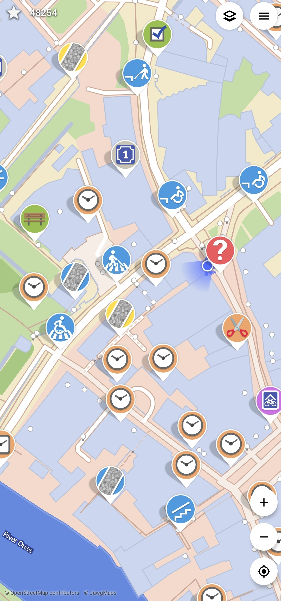
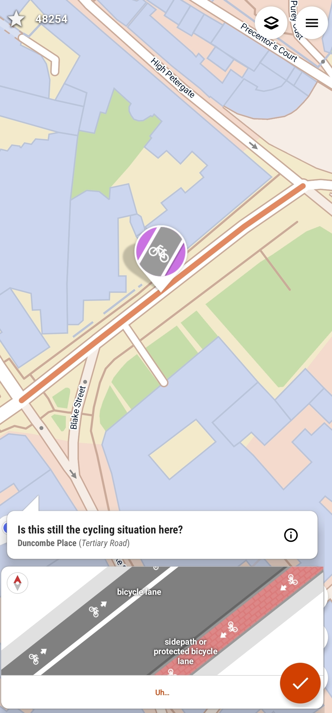
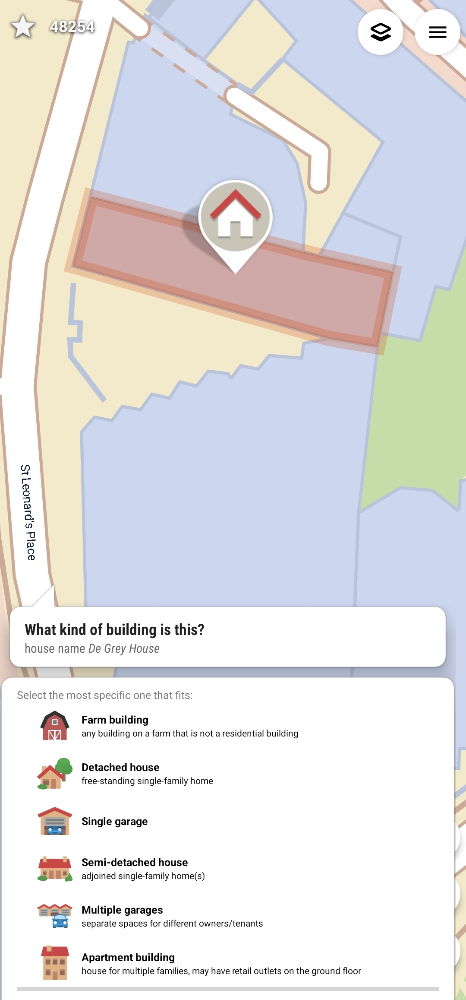
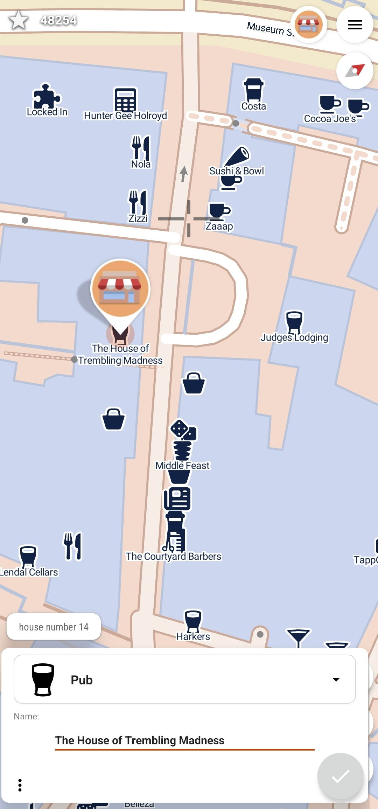
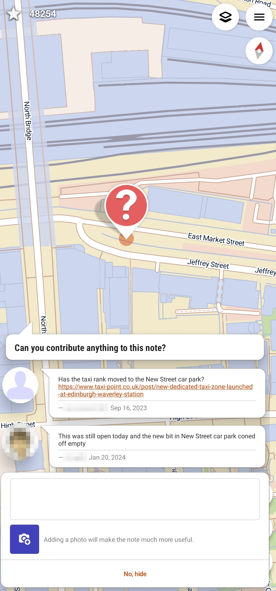
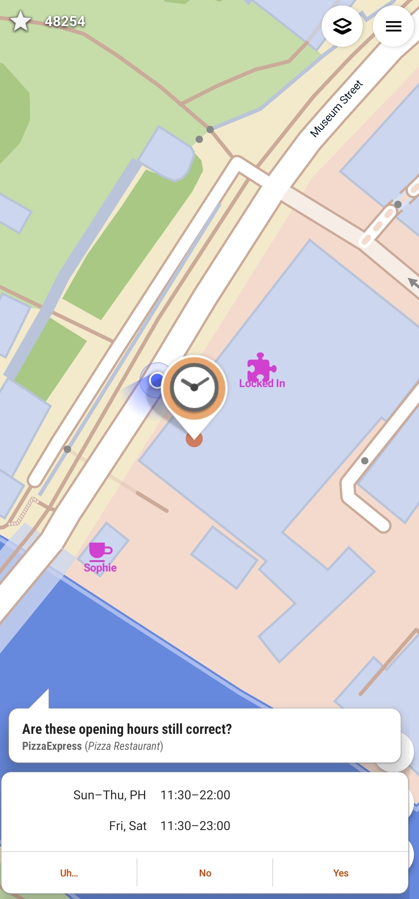
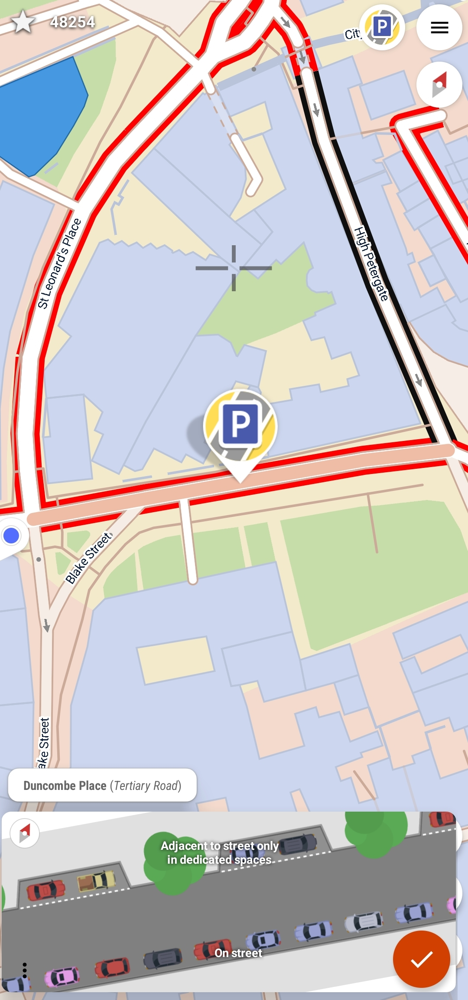
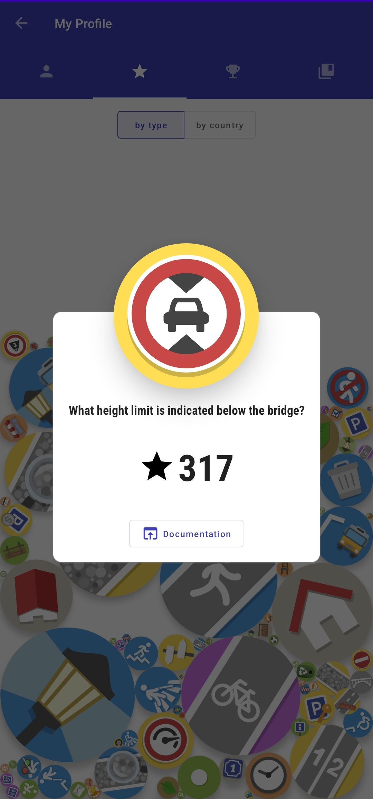

StreetComplete is an easy to use editor of OpenStreetMap data available for Android. It can be used without any OpenStreetMap-specific knowledge. It asks simple questions, with answers directly used to edit and improve OpenStreetMap data. The app is aimed at users who do not know anything about OSM tagging schemes but still want to contribute to OpenStreetMap.

StreetComplete automatically looks for nearby places where a survey is needed and shows them as quest markers on its map. Each of these quests can then be solved on site by answering a simple question. For example, tapping on a marker may show the question "What is the name of this road?", with a text field to answer it.
More examples are shown in the screenshots below.

The user's answer is automatically processed and uploaded directly into the OSM database. Edits are done in meaningful changesets using the user's OSM account.
Since the app is meant to be used on a survey, it can be used offline and is
economic with data usage.

To make the app easy to use, quests are limited to those answerable by asking simple questions.

* See the [latest release notes](https://github.com/streetcomplete/StreetComplete/releases).

## Screenshots
       

## Download

## Quests

There are quite a few different quest types now and more will be added over time.
You can see a community-managed [list of all quests in the OSM wiki](https://wiki.openstreetmap.org/wiki/StreetComplete/Quests).

## FAQ

You can find a list of [frequently asked questions in the wiki](https://wiki.openstreetmap.org/wiki/StreetComplete/FAQ).

## Contributing

This is an active open-source project, so you can get involved in it easily!
You can do so **without any programming or OpenStreetMap knowledge**! Just choose a task that you like.

Here are a few things you can do:
* 🐛 [Test and report issues](CONTRIBUTING.md#testing-and-reporting-issues)
* 📃 [Translate the app into your language](CONTRIBUTING.md#translating-the-app)
* 🕵️ [Solve notes left by StreetComplete users](CONTRIBUTING.md#solving-notes)
* 💡 [Suggest new quests](CONTRIBUTING.md#suggesting-new-quests), or, even better, [implement them](CONTRIBUTING.md#developing-new-quests).
* ➕ [and more…](CONTRIBUTING.md)

Also, if you like StreetComplete, **spread the word**! ❤️

## License

This software is released under the terms of the [GNU General Public License](http://www.gnu.org/licenses/gpl-3.0.html).

## Sponsors

<a href="https://github.com/sponsors/westnordost"><picture><source media="(prefers-color-scheme: dark)" srcset=".github/images/logo_github_dark.svg"></picture></a>  <a href="https://www.patreon.com/westnordost"><picture><source media="(prefers-color-scheme: dark)" srcset=".github/images/logo_patreon_dark.svg"></picture></a> 
Many users are currently supporting this app through <a href="https://github.com/sponsors/westnordost">GitHub sponsors</a>, <a href="https://liberapay.com/westnordost">Liberapay</a> and <a href="https://www.patreon.com/westnordost">Patreon</a>. If you like the app, you can join them ☺️ to support the continued development and maintenance of the app. 
 

 
Within the frame of **Prototype Fund** <a href="https://prototypefund.de/en/project/streetcomplete-for-ios/">round 15</a> (March 2024 to August 2024), the German Federal Ministry of Education and Research currently sponsors Tobias Zwick to work on StreetComplete for iOS. 
Development on this app was also sponsored in <a href="https://prototypefund.de/en/project/streetcomplete/">round 8</a> (September 2020 to February 2021) of the Prototype fund, with focus on collecting more data points and on general improvements of this app. 
 

 
Since mid 2020, **JawgMaps** provides their vector map tiles service to StreetComplete for free, i.e. the background map displayed in the app. 
 

## Past Sponsors

 
The **NLnet foundation** sponsored development on this app in three individual grants with funds from the European Commission: 
<a href="https://www.openstreetmap.org/user/Mateusz%20Konieczny/diary/368849">Two</a> <a href="https://www.openstreetmap.org/user/Mateusz%20Konieczny/diary/397825">grants</a> given to Mateusz Konieczny in 2019 and 2021 enabled him to work on StreetComplete for about one year in total, with a focus on clearer UI and improvements on data collection.
Furthermore, <a href="https://nlnet.nl/project/StreetComplete-Together/">yet another grant</a> enabled Tobias Zwick to work about five months in 2021/2022 on - most notably - the overlays functionality and measuring with AR. 
 

 
In August 2020, the **OpenStreetMap foundation** funded the development of <a href="https://wiki.openstreetmap.org/wiki/Microgrants/Microgrants_2020/Proposal/Map_Maintenance_with_StreetComplete">Map Maintenance with StreetComplete</a> within the frame of the <a href="https://blog.openstreetmap.org/2020/07/01/osmf-microgrants-program-congratulations-to-selected-projects/">microgrants program</a>. 
