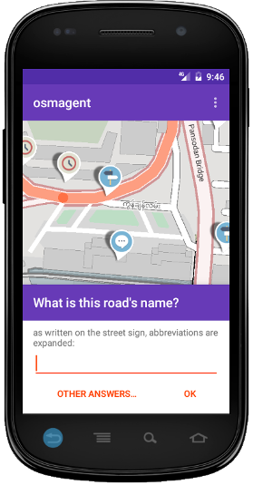

#StreetComplete

Is currently in Beta. 

[ (Izzisoft F-Droid Repository)](https://apt.izzysoft.de/fdroid/index/apk/de.westnordost.streetcomplete)

An Android app which finds wrong, incomplete or extendable data in the user's vicinity and provides
him the tools to complete these easily and directly on site without having to use another editor.

The found issues are presented to the user as markers on a map (like i.e. in Mapdust) that each are
solvable by filling out a simple form to complete/correct the information on site. The user's
answer is then processed and directly uploaded into the OSM database in atomic commits in the name
of the user's OSM account.
Since the app is meant to be used on a survey, it can be used offline and otherwise aims to be
economic with data usage.

The app is aimed at users who do not know anything about OSM tagging schemes but still want to
contribute to the OpenStreetMap by surveying their neighbourhood (or other places as well). Because of the target group, only those quests are shown which are answerable very clearly by asking one simple question and only those quests are created which contain very few false positives.

## State of Development

Right now, there are very little different question types. I will add more and more over time.

## Contributing

Right now, if you are mildly interested in StreetComplete, the best way is to use, test it and give constructive feedback.

Also, I need help with translations (other than German, English). You can add your language and contribute [here](https://poeditor.com/join/project/IE4GC127Ki).

## License

This software is released under the terms of the [GNU General Public License](http://www.gnu.org/licenses/gpl-3.0.html).