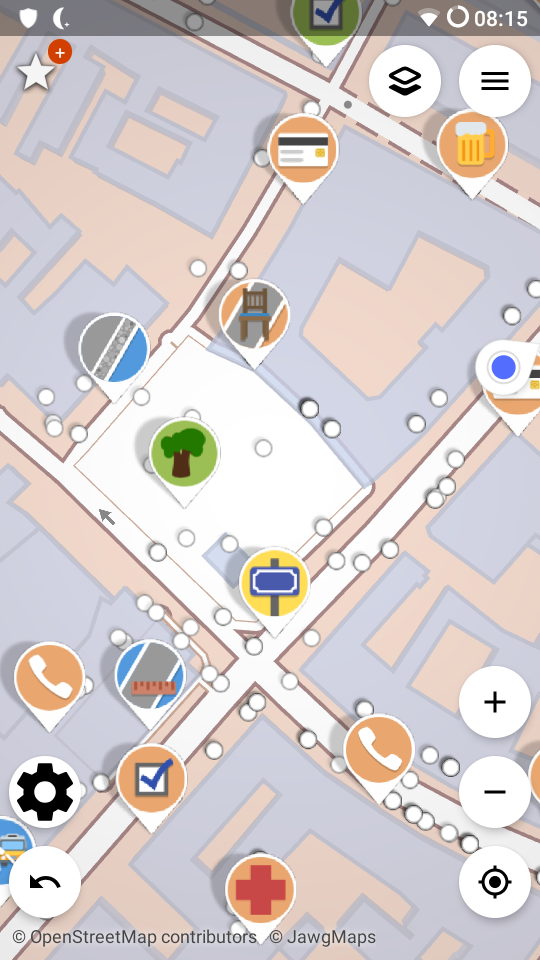
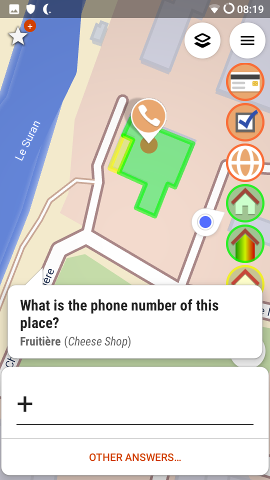
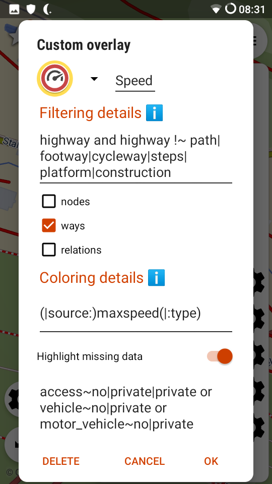
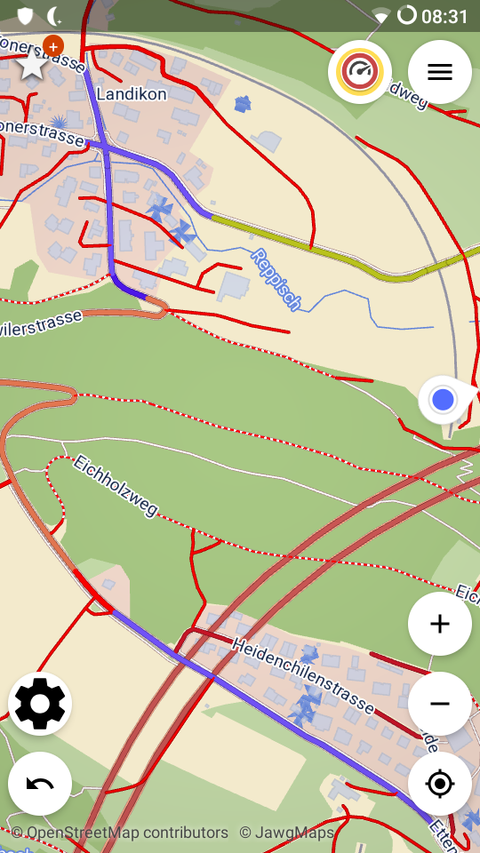
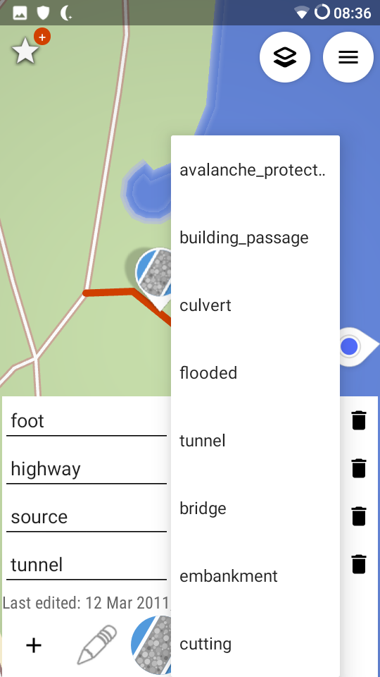
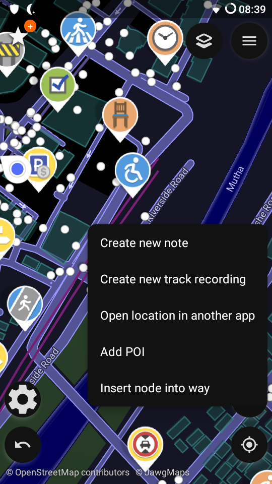
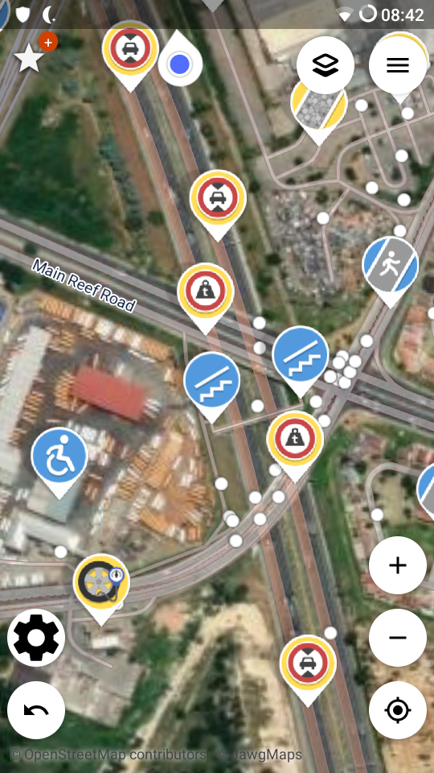
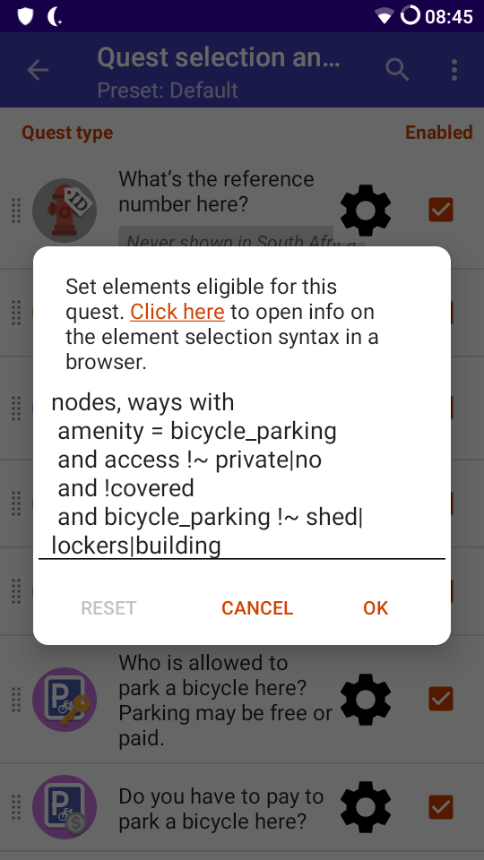

SCEE is a modified version of StreetComplete, aimed at experienced OSM users unhappy about the lack of advanced editing capabilities in normal StreetComplete.
By default, most of the additional capabilities are disabled. Go through the settings (either in the app or [below](#differences-to-streetcomplete)) for details.

Please be aware that SCEE is not suitable for people used to discarding warning messages without reading!
Users new to OpenStreetMap are best advised to use [StreetComplete](https://github.com/streetcomplete/StreetComplete).

Functionality added in SCEE is considerably less tested than what you might be used to in StreetComplete, so bugs or unexpected behavior may happen. If you encounter any, please report the issue.

1. [Download](#download-scee)
2. [Translate](#translations)
3. [Additional permissions](#permissions)
4. [Differences to StreetComplete](#differences-to-streetcomplete)
5. [Contributing quests](#contributing-quests)
6. [Differences in changesets](#changeset-differences-compared-to-streetcomplete)

[StreetComplete readme](README_StreetComplete.md)

## Download SCEE

F-Droid releases of SCEE make use of reproducible builds, so releases on F-Droid and GitHub are signed with the same keys. This means you can switch between GitHub and F-Droid releases anytime without needing to uninstall first.

__F-Droid anti-feature__ _non-free network_: SCEE uses map tiles provided by [jawg](https://www.jawg.io), and optionally [aerial / satellite imagery](https://server.arcgisonline.com/arcgis/rest/services/World_Imagery/MapServer) by [Esri](https://www.esri.com).

## Translations
Translations for strings added in SCEE can be done [using Weblate](https://translate.codeberg.org/projects/scee/).
You will need an account to update translations and add languages. Add the language you want to translate to in _Languages_ -> _Manage translated languages_ in the top menu bar.

## Permissions
SCEE asks for two more permissions than StreetComplete: `ACCESS_BACKGROUND_LOCATION` and `POST_NOTIFICATIONS`. Both are requested and used only in feature to notify about nearby quests while the app is in the background.

## Differences to StreetComplete
* Non-optional differences to StreetComplete
  * No star count on main screen
  * When using auto-upload, an indicator now shows when there are changes waiting to be uploaded
  * Dark theme uses dark buttons
  * Prevent short scroll to user location at app start when map was at a different position
  * Downloading data will interrupt upload queue (will resume afterwards)
  * Manual downloads can be queued instead of always cancelling the previous one (**currently not working, option is not shown**)
  * Show all hidden quests on long press on undo button (works only for downloaded areas)
  * Additional answers for some quests
    * Additional building types
    * Additional path surfaces
    * Specify that a crossing is raised
    * Answer non-marked lanes with a count
    * Answer "no seating, but not takeaway only"
    * Add wheelchair description when answering wheelchair quest
  * Move the "no cycleway" answer to more accessible position
  * Highlight obstacles along the way for smoothness quests
  * Open settings when pressing menu key in main menu dialog
  * Allow switching to aerial view while adding or moving a node
  * Some potential performance improvements
* New quests that are not eligible for StreetComplete, usually because some answers cannot be tagged, or because not everyone has the required knowledge to answer the quest
  * Material of benches and picnic tables
  * Phone number and website
  * Cuisine
  * Healthcare speciality
  * Outdoor seating type
  * Service building type
  * Service building operator
  * Street cabinet type
  * Artwork type
  * Railway platform number
  * Trail visibility of hiking trails
  * Genus / species of trees
    * Allows providing a file containing translated tree names instead of the default English ones
  * Color of building roofs
  * Whether a barrier is locked
  * Height of barriers
  * Whether pharmacy is dispensing prescription drugs
  * Destination of some road types after intersections
  * Which beers are sold in restaurants
  * Elevation, ref, sports and name of guideposts
  * Width of footways
  * Size and type of maps
  * Via ferrata scale
  * Difficulty and ref for pistes, and whether they are lit
  * Quests based on external sources
    * Osmose quest showing Osmose issues as quests, with filter options
    * Custom quest from CSV file, allows creating nodes (see in-app description)
  * Show POI quests with the sole purpose of indicating existence of elements of chosen type (may show labels)
  * Option to show only quests added in SCEE in quest selection menu
  * Some "other answers" result in a modified changeset comment (because in SCEE they may contain more unexpected changes)
* Customizable overlays: Choose which elements are highlighted, and which tag is used to determine the color
* Turn restriction overlay
* Settings
  * Additional darker dark theme
  * Background map can be changed to aerial / satellite imagery
  * Separate deletion of quest and map tile cache
  * Adjust location update intervals
  * Log reader (not a setting, but it's in the menu)
  * Expert mode that enables capabilities, some of which can be dangerous when used by inexperienced OSM contributors
    * Directly edit tags, with suggestions from iD and last used values
    * Add nodes everywhere, either free-floating or as part of a way
      * inserting nodes into a way may actually re-use existing nodes at that position
    * Delete free-floating nodes
    * Additional "other answers"
      * add `access=private` to benches, bicycle parkings, picnic tables, pitches, (leisure) tracks and recycling containers
      * add/adjust highway access
      * tag highways as under construction (with finish date)
      * tag buildings as demolished
      * add conditional maxspeed (maxspeed quest only)
    * Allow moving nodes that are part of a way (including a clear warning about changing geometry)
    * Allow disabling and moving the note quest
    * Allow closing notes
  * Some of the settings below can only be enabled in expert mode
  * Quest settings for most quests, mostly for customized element selection, but also for other things like allowing generic paved surface answer without note
    * Such customization should be handled with care. There are some safeguards, but modifying element selection could still lead to inappropriate tagging, quests being asked over and over again, and maybe app crashes.
    * Quests without settings need to be handled individually. Please open an issue if you want specific settings.
  * UI settings
    * Quick settings button for switching preset, background and reverse quest order. Also contains a level filter for displayed quests / overlay elements
    * Quick selector for overlays (on main screen)
    * Show next quest for this element immediately
    * Show nearby quests / other quests for same element when quest form is open
    * Hide button for temporarily hiding quests (long press for permanent hide)
    * Show keyboard automatically on showing feature search dialog when adding a node
    * Auto-select first edit when opening edit history
    * Search features in local language and all languages enabled in the system
    * Select how many lines the form needs to have to move recent selection to front
    * Show all main menu items as grid
    * Add a _switch preset_ button to main menu (only if not a grid)
    * Capitalize words when entering names
    * Zoom using volume buttons
  * Display settings
    * Disable 3D buildings
    * Show arrows indicating direction of highlighted way
    * Highlight geometries for nearby quests
    * Put pin on exact location of a quest
    * Disable quest solved animation
    * Provide GPX track and have it always shown on the map
  * Quest settings
    * Hide or increase priority of quests depending on time of day
    * Force resurvey for specific tags
    * Different quest settings for each preset
    * Dynamic quest creation for immediately applying changed quest settings and resurvey intervals
    * Notifications about nearby quests when app is in background
    * Hide overlay-specific quests when overlay is enabled
  * Note settings
    * Create personal notes in a GPX file (adds a new button when creating a note)
    * Swap OSM and GPX note buttons, for switching default notes
    * Disable hiding the keyboard before creating a note
    * Create custom quests like notes
    * Save full-size photos made for notes
    * Hide notes created by specific users
  * Data management settings
    * Disable auto-download
    * Disable always downloading map data on manual download, even if data is fresh
    * Choose tile URL for aerial imagery
    * Set data retention time
    * Store map tiles on SD card
    * Disable local statistics updates (hides achievement messages)
    * Import / export
      * Custom overlays
      * Quest presets, including per-preset quest settings
      * Hidden quests
      * All other settings, including quest settings and recently selected answers. Does not export login data.
* When uploading from a debug build without being logged in, all uploads return fake success without contacting OSM API. This is used for testing parts of the uploader.

Database and preferences files are compatible with StreetComplete, so if you have root privileges you can transfer them in either direction.

## Contributing quests
The original [contributing guidelines](README_StreetComplete.md#contributing) are still valid, but note that the [guidelines for contributing a quest](QUEST_GUIDELINES.md) have been significantly relaxed:
* Creating, moving and deleting nodes is possible
  * Inserting nodes into a way is not (yet) possible
* Guidelines are useful suggestions, but not enforced
* Quests may be based on external sources like Osmose, not just on element selection

## Changeset differences compared to StreetComplete
This section is aimed for people trying to decide whether a bad edit done in SCEE is fault of the user or of the app (SCEE modifications).
In general, SCEE changesets will contain changes very similar to StreetComplete changesets, with following differences:
* `created_by` is set to `StreetComplete_ee <version>`
* _AddBuildingType_ has additional answers `barn`, `sty`, `stable`, `cowshed`, `digester`, `presbytery`, `riding_hall`, `sports_hall`, `tent`, `elevator`, and `transformer_tower`
* _AddCrossingType_ may change `crossing_ref`, `crossing:markings`, and `traffic_calming`
* _AddPathSurface_ and _AddRoadSurface_ have additional surfaces `metal_grid` and `stepping_stones`
* _AddMaxSpeed_ may tag `maxspeed:conditional`
* [Discardable tags](https://wiki.openstreetmap.org/wiki/Discardable_tags) are removed automatically 
* Any node may be moved, even if it is part of a way or relation
* Any node may be deleted, or have all tags removed if it's not free-floating
* `check_date:*` may be added without resurvey
* Wheelchair quests may add `wheelchair:description` and `wheelchair:description:<language>`
* An element at the same position as a note may be edited (this is blocked in normal SC)
* Most quests may apply to an extended range of elements (user-defined)
* Starting with SCEE 52.0, some answers create separate changesets with comment `Other edits in context of: <orignal quest changeset comment>`.
This happens for changes that can occur in StreetComplete, such as moving or deleting a node, changing shop types, removing surface, changing highway to steps and removing sidewalks.
Furthermore SCEE adds new answers leading to such a changeset comment:
  * All quest types related to roads / paths may adjust access tags
  * Quests types asking about about benches, picnic tables, recycling containers, bicycle parkings and sports tracks/pitches may tag `access=private`
  * All quest types related to buildings may change `building` to `demolished:building`
* SCEE contains some additional [quests (scroll to bottom)](app/src/main/java/de/westnordost/streetcomplete/quests/QuestsModule.kt) and [overlays](app/src/main/java/de/westnordost/streetcomplete/overlays/OverlaysModule.kt), recognizable in the files by `EE_QUEST_OFFSET`
  * They usually do not fulfill the requirements for StreetComplete, and need to be enabled by the user first
* There are further "quest types" (though neither quests nor overlays, they are identified in `StreetComplete:quest_type` changeset tag)
  * _TagEdit_: may modify any tag
  * _AddNode_: adds nodes, free floating or part of ways, (may change tags of existing way node instead of inserting a new one under some circumstances)

## Screenshots
       
