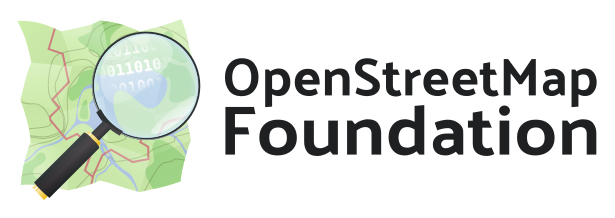

Readme of [StreetComplete](https://github.com/streetcomplete/StreetComplete)

StreetComplete is an easy to use editor of OpenStreetMap data available for Android. It can be used without any OpenStreetMap-specific knowledge. It asks simple questions, with answers directly used to edit and improve OpenStreetMap data. The app is aimed at users who do not know anything about OSM tagging schemes but still want to contribute to OpenStreetMap.

StreetComplete automatically looks for nearby places where a survey is needed and shows them as quest markers on its map. Each of these quests can then be solved on site by answering a simple question. For example, tapping on a marker may show the question "What is the name of this road?", with a text field to answer it.
More examples are shown in the screenshots below.

The user's answer is automatically processed and uploaded directly into the OSM database. Edits are done in meaningful changesets using the user's OSM account.
Since the app is meant to be used on a survey, it can be used offline and is
economic with data usage.

To make the app easy to use, quests are limited to those answerable by asking simple questions.

* See the [latest release notes](https://github.com/streetcomplete/StreetComplete/releases).

## Download

## Quests

There are quite a few different quest types now and more will be added over time.
You can see a community-managed [list of all quests in the OSM wiki](https://wiki.openstreetmap.org/wiki/StreetComplete/Quests).

## FAQ

You can find a list of [frequently asked questions in the wiki](https://wiki.openstreetmap.org/wiki/StreetComplete/FAQ).

## Contributing

This is an active open-source project, so you can get involved in it easily!
You can do so **without any programming or OpenStreetMap knowledge**! Just choose a task that you like.

Here are a few things you can do:
* 🐛 [Test and report issues](CONTRIBUTING.md#testing-and-reporting-issues)
* 📃 [Translate the app into your language](CONTRIBUTING.md#translating-the-app)
* 🕵️ [Solve notes left by StreetComplete users](CONTRIBUTING.md#solving-notes)
* 💡 [Suggest new quests](CONTRIBUTING.md#suggesting-new-quests), or, even better, [implement them](CONTRIBUTING.md#developing-new-quests).
* ➕ [and more…](CONTRIBUTING.md)

Also, if you like StreetComplete, **spread the word**! ❤️

## License

This software is released under the terms of the [GNU General Public License](http://www.gnu.org/licenses/gpl-3.0.html).

## Sponsors

 
<a href="https://nlnet.nl/discovery/">NGI Zero Discovery</a> is a grant program organized by the NLnet foundation which sponsored the development on this app in three individual grants: 
Grants given to Mateusz Konieczny in <a href="https://www.openstreetmap.org/user/Mateusz%20Konieczny/diary/368849">2019</a> and <a href="https://www.openstreetmap.org/user/Mateusz%20Konieczny/diary/397825">2021</a> enabled him to work on StreetComplete for about one year in total.
Furthermore, yet another grant from <a href="https://nlnet.nl/project/StreetComplete-Together/">2021</a> enabled Tobias Zwick to work on the app for about 4-5 months! 
 

 
The <a href="https://bmbf.de/">German Federal Ministry of Education and Research</a> sponsored Tobias Zwick to work on this project (grant code 01IS20S35) within the frame of round 8 of the <a href="https://prototypefund.de/en/project/streetcomplete/">Prototype Fund</a> for about six months in 2020/2021. 
 

   
Many people are currently supporting this app through <a href="https://github.com/sponsors/westnordost">GitHub sponsors</a>, <a href="https://liberapay.com/westnordost">Liberapay</a> and <a href="https://www.patreon.com/westnordost">Patreon</a>. If you like the app, you can join them ☺️ to support the continued support and maintenance of the app. 
 

 
<a href="https://www.jawg.io">JawgMaps</a> is a provider of online custom maps, geocoding and routing based on OpenStreetMap data. They are providing their vector map tiles service to StreetComplete for free, i.e. the background map displayed in the app.</td>
 

 
The <a href="https://osmfoundation.org/">OpenStreetMap foundation</a> was funding the development of doing <a href="https://wiki.openstreetmap.org/wiki/Microgrants/Microgrants_2020/Proposal/Map_Maintenance_with_StreetComplete">map maintenance with StreetComplete</a> (~ 3 weeks) in their <a href="https://blog.openstreetmap.org/2020/07/01/osmf-microgrants-program-congratulations-to-selected-projects/">first round</a> of the <a href="https://wiki.osmfoundation.org/wiki/Microgrants">microgrant program</a> in 2020.
