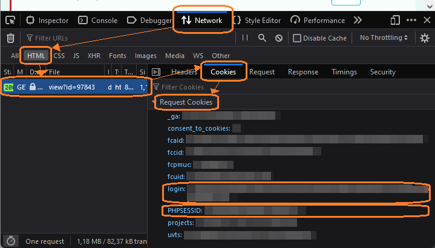

# Checklist for creating a release

### (optional:) Maintenance

A new release is a good time to check if all dependencies are still up to date.

- **Update outdated dependencies** as indicated by Android Studio in the `build.gradle`. For each to-be-updated dependency, review the changelog (see [release notes for androidx libraries](https://developer.android.com/jetpack/androidx/releases/appcompat)) - are there any (breaking) changes that may affect us? Test it.
- **Update available languages**. Check [on POEditor](https://poeditor.com/projects/view?id=97843) if any translation not included yet reached a certain threshold of completion (~80%) to be included or if any already included translation has been abandoned (only ~50% translated). If necessary, adapt `bcp47ExportLanguages` in `app/build.gradle.kts` and mention the change in the changelog.
- **Update presets version**. Check if `presetsVersion` and `nsiVersion` in the `build.gradle` still point to the latest version of the [iD presets](https://github.com/openstreetmap/id-tagging-schema/releases) and [name suggestion index](https://github.com/osmlab/name-suggestion-index/tags) respectively, check if the schema has any incompatible changes and update. 
- **Update main contributor listing and other manual credit handling**. In general credits are updated automatically (see below), but [main contributors](/app/src/main/res/raw/credits_main.yml) and list of ignored commits ([`skipCommit`](/build.gradle.kts#L75)) are handled manually.

### Update translations, presets, metadata, credits, ...

This is done by executing the `updateStreetCompleteData` gradle task. However, some subtasks need setting up first before they are run.

For `app:updateTranslatorCredits`:
- (one-time:) [Get a POEditor API token](https://poeditor.com/account/api) and put it in your `<user home>/.gradle/gradle.properties` as `POEditorAPIToken=<the api token>`
- (every time:) [Login to POEditor](https://poeditor.com/projects/view?id=97843), press F12 to bring up the developer tools, reload the page and copy from the request cookies sent in displaying the page the `login` and the `PHPSESSID` cookie. Paste it into your `<user home>/.gradle/gradle.properties` as `POEditorCookie=<your login cookie>` and `POEditorPHPSESSID=<your PHPSESSID>` 

For `app:updateTranslations`: one-time setup of POEditor API token as described above.

For `updateContributorStatistics`:
- (one-time:) [Create a GitHub personal access token](https://docs.github.com/authentication/keeping-your-account-and-data-secure/managing-your-personal-access-tokens) (no permissions required) and put it in your `<user home>/.gradle/gradle.properties` as `GithubApiToken=<the api token>`

After executing `updateStreetCompleteData`, let Android Studio check this by running _Analyze -> Run inspection by name_ , type "Invalid format string". Translators often make the mistake to not correctly write the placeholders (`%s`, `%1$s`, `%2%d` etc.) in their translations. This can lead to a crash when the string is displayed. 
Correct any mistakes found by the inspection directly in POEditor if possible (otherwise delete the offending string) and re-import the translations again (gradle task `app:updateTranslations`) until the inspections come out clean.

### Prepare Release

1. Go through the git history since the last release and update the `app/src/main/res/raw/changelog.yml`. Make sure to credit everyone (use "by ..." if something was contributed by a person and "thanks ..." if that person helped but did not do it (all) himself) and reference the related pull requests and issues.
2. In the `build.gradle`, increase the `versionCode` and the `versionName`.
3. Run the gradle task `app:installRelease` to deploy the release on your smartphone.
4. Test if all works as expected. At least look at the changelog and download quests.
5. Commit and push.
6. In Android Studio, select _Build -> Generate Signed Bundle / APK_. You need both. You should first create the APK, then the bundle, because the build process for the APK clears the directory in which the Bundle/APK is placed. Rename the created files to match the release name, e.g. "StreetComplete-v99.0-beta9.apk". Build the bundle with the `releaseGooglePlay` config.

### Publish Release on GitHub

1. On GitHub, [create a new release](https://github.com/streetcomplete/StreetComplete/releases/new).
2. Create a new tag by tapping on _Choose a tag_, type the name, e.g. "v99.0-beta9" and press _Create new tag: v99.0-beta9 on publish_
3. Select the branch you built the APK on. Usually it is master.
4. Copy&paste the text from the `changelog.yml` into the textbox
5. Attach the **APK**.
6. If it is a beta, check the _This is a pre-release_ box. For major releases, you may want to check the box to create a discussion.
7. Double-check you really committed and pushed the release before publishing.

### Publish Release on Google Play

1. In the [Google Play Console](https://play.google.com/console/), select _Production_ to release a public release or select 
_Testing -> Open Testing_ to release a beta release.
2. Tap _Create New Release_ in the upper right corner.
3. Upload the **bundle**
4. In the field _Release name_, just input the version name, e.g. "v99.0-beta9". In the _Release notes_, we just refer to the changelog on GitHub (e.g. `<en-US>https://github.com/streetcomplete/StreetComplete/releases/tag/v99.0-beta9</en-US>`) because the character limit is too short for a proper changelog.
5. Finally, press on _Save_, then _Review release_. Review the release.

### After the release

There might be bug fixes for the latest release that should be published as a minor version (before any new major version). If there are already changes for the next major version in the `master` branch then, create a release branch from the latest tag: E.g. for tag `v99.0`, create branch `99` with `git checkout -b 99 v99.0`. Then fix the bugs in the `master` branch and cherry-pick them to the release branch. The release branch can be deleted once the next major version is published.
